# Distributed Microservices — E-Commerce Platform (Java Quarkus)

A production-grade, highly resilient, and fully observable **microservices e-commerce backend** built in **Java 21** using **Quarkus** reactive framework (v3.31.3). Designed around domain-driven service boundaries following Clean Architecture and CQRS principles, each service runs as an **independent JVM process** with its own gRPC server, database migrations, and caching layer — achieving true service-level isolation and independent deployability.

Each e-commerce business domain — Users, Roles, Auth, Products, Categories, Cart, Orders, Shipping, Merchants, Reviews, Transactions, Banners, Sliders — lives in its own self-contained Maven module, running as a **standalone microservice**. These services communicate synchronously via high-performance **gRPC** protocols and asynchronously using **Apache Kafka** event propagation, exposing a unified reactive entry point through a **GraphQL API Gateway** powered by Quarkus SmallRye GraphQL.

The platform is fortified with a **comprehensive observability suite** (Prometheus, Grafana, Loki, Jaeger, OpenTelemetry), **distributed Redis caching** with custom telemetry for each service, **ClickHouse analytics**, and Kubernetes configurations ready for production auto-scaling.

---

## Key Features

| Domain | Capabilities |
| :--- | :--- |
| **Auth & Users** | Secure registration, multi-factor login, stateless JWT access/refresh token lifecycle, password reset workflows, OTP email verification, and `/me` profile GraphQL query. |
| **Roles & RBAC** | Custom permission configuration, granular access control matrices, and sub-second permission evaluation cached via Redis. |
| **Catalog & Products** | Full CRUD for products & categories, promo banners, and home slider carousels. |
| **Cart & Commerce** | Add-to-cart, checkout workflows, order lifecycle management, order-item decomposition, and shipping address details. |
| **Merchants** | Fully featured merchant onboarding, profile details management, business data registration, policies, and merchant awards. |
| **Transactions** | Centralized financial audit ledger collecting transaction and payment events across the system, global search filters, and status tracking. |
| **Reviews** | Product ratings & detailed review submissions post-purchase. |
| **Email Worker** | Kafka-driven asynchronous worker dispatching critical notification emails (OTPs, login alerts, merchant onboarding notices, and transaction invoices) via SMTP. |
| **ClickHouse Analytics** | Columnar analytics database for high-performance statistical queries — order revenue, merchant sales, transaction amounts, category prices. Three-component pipeline: stats-writer (Kafka→ClickHouse), stats-reader (gRPC→Redis cache), stats-backfill (PostgreSQL→outbox→Kafka→ClickHouse). |
| **Transactional Outbox** | Reliable event publishing via outbox pattern — events written to DB within business transaction, relayed to Kafka by OutboxPublisher. Guarantees no event loss even during Kafka outages. |
| **Observability** | Multi-dimensional metrics (Prometheus + Grafana), log aggregation (Loki + Logback), end-to-end distributed tracing (Jaeger + OpenTelemetry), and resource monitors (Node, Kafka, Postgres Exporters). |
| **Deployment** | Local orchestration using Docker Compose with PostgreSQL, Redis, Kafka, and observability stack. Auto-scaling Kubernetes manifests with Horizontal Pod Autoscalers (HPA) and ArgoCD GitOps. |

---

## Architecture Overview

The platform implements a **Distributed Microservices** architecture. Each business service runs as an **independent JVM process** with its own gRPC server, database connection pool, and Flyway migrations. A **Quarkus GraphQL API Gateway** acts as the unified edge router, exposing a single GraphQL schema (queries & mutations) and transforming client GraphQL operations into fast gRPC downstream communications via Quarkus gRPC clients.

### Core Architecture Principles

- **Service-Level Isolation**: Every microservice runs as an independent JVM process with its own gRPC server, database connection pool, caching layer, and Flyway migrations. No shared-memory coupling between services.
- **Clean Architecture & CQRS**: Separation of concerns using `Handler (gRPC) → Service (Command/Query) → Repository (Command/Query)` layers ensures business logic remains clean, performant, and framework-agnostic.
- **Reactive Execution**: Powered entirely by Quarkus reactive engine and Mutiny, enabling high throughput with minimal resource footprints.
- **Direct DB Connections**: Each service manages its own PostgreSQL connection pool with Agroal, with configurable `max-size` and `acquisition-timeout` per service.
- **Event-Driven Resilience**: Apache Kafka decouples transaction events via the transactional outbox pattern, ensuring side effects like email billing remain completely non-blocking.
- **OTel Telemetry Integration**: Standardized OpenTelemetry middleware injects trace IDs across gRPC boundaries, allowing seamless trace propagation from the client GraphQL gateway down to postgres operations.

```mermaid
graph TB
    classDef client fill:#0f172a,stroke:#38bdf8,color:#e0f2fe,stroke-width:2px,font-weight:bold
    classDef gateway fill:#1e293b,stroke:#22d3ee,color:#cffafe,stroke-width:2px,font-weight:bold
    classDef domain fill:#1e1b4b,stroke:#818cf8,color:#e0e7ff,stroke-width:1.5px
    classDef infra fill:#172554,stroke:#60a5fa,color:#dbeafe,stroke-width:1.5px
    classDef obs fill:#052e16,stroke:#4ade80,color:#dcfce7,stroke-width:1.5px
    classDef event fill:#431407,stroke:#fb923c,color:#fed7aa,stroke-width:1.5px

    Client["Client Applications<br/>(Web / Mobile / API)"]:::client

    subgraph APIGateway["API Gateway — NGINX + Quarkus GraphQL Gateway"]
        direction LR
        GQL["GraphQL API Handler<br/>Port :5000"]:::gateway
        AuthMW["JWT Auth & Role<br/>Middleware"]:::gateway
    end

    Client -->|"GraphQL over HTTP"| APIGateway

    subgraph BusinessServices["Business Domain Services (Java Quarkus)"]
        direction TB

        subgraph IdentityDomain["Identity & Access"]
            AUTH["Auth Service<br/>JWT & BCrypt Server"]:::domain
            USER["User Service<br/>Profile Management"]:::domain
            ROLE["Role Service<br/>RBAC & Permissions"]:::domain
        end

        subgraph MerchantDomain["Merchant Suite"]
            MERCH["Merchant Service<br/>Onboarding & Profiling"]:::domain
            MERCH_DETAIL["Merchant Detail Service"]:::domain
            MERCH_BIZ["Merchant Business Service"]:::domain
            MERCH_POLICY["Merchant Policy Service"]:::domain
            MERCH_AWARD["Merchant Award Service"]:::domain
        end

        subgraph CatalogDomain["Catalog & Marketing"]
            PROD["Product Service<br/>Product Catalog CRUD"]:::domain
            CAT["Category Service<br/>Product Categorization"]:::domain
            BANNER["Banner Service<br/>Offers & Promos"]:::domain
            SLIDER["Slider Service<br/>Carousel Slides"]:::domain
        end

        subgraph OrderDomain["Checkout & Cart"]
            CART["Cart Service<br/>Basket Operations"]:::domain
            ORDER["Order Service<br/>Checkout & Order Flows"]:::domain
            SHIP["Shipping Service<br/>Customer Addresses"]:::domain
        end

        subgraph TransactionDomain["Payments & Reviews"]
            TXN["Transaction Service<br/>Central Audit Register"]:::domain
            REV["Review Service<br/>Ratings & Feedback"]:::domain
            REV_DTL["Review Detail Service"]:::domain
        end
    end

    GQL -->|"Quarkus gRPC Client"| AUTH
    GQL -->|"Quarkus gRPC Client"| USER
    GQL -->|"Quarkus gRPC Client"| ROLE
    GQL -->|"Quarkus gRPC Client"| MERCH
    GQL -->|"Quarkus gRPC Client"| PROD
    GQL -->|"Quarkus gRPC Client"| CAT
    GQL -->|"Quarkus gRPC Client"| BANNER
    GQL -->|"Quarkus gRPC Client"| SLIDER
    GQL -->|"Quarkus gRPC Client"| CART
    GQL -->|"Quarkus gRPC Client"| ORDER
    GQL -->|"Quarkus gRPC Client"| TXN
    GQL -->|"Quarkus gRPC Client"| REV

    subgraph Infrastructure["Infrastructure Layer"]
        direction LR
        PG[("PostgreSQL<br/>ECOMMERCE DB<br/>:5432")]:infra
        REDIS[("Redis<br/>Standalone Cache :6379")]:infra
        KAFKA[("Kafka Broker<br/>Event Bus :9092")]:infra
        CLICKHOUSE[("ClickHouse<br/>Analytics DB :8123")]:infra
    end

    AUTH -->|"JDBC + Reactive SQL"| PG
    USER -->|"JDBC + Reactive SQL"| PG
    ROLE -->|"JDBC + Reactive SQL"| PG
    MERCH -->|"JDBC + Reactive SQL"| PG
    PROD -->|"JDBC + Reactive SQL"| PG
    CAT -->|"JDBC + Reactive SQL"| PG
    CART -->|"JDBC + Reactive SQL"| PG
    ORDER -->|"JDBC + Reactive SQL"| PG
    TXN -->|"JDBC + Reactive SQL"| PG
    REV -->|"JDBC + Reactive SQL"| PG

    STATS_R --> CLICKHOUSE
    STATS_W --> CLICKHOUSE

    AUTH -->|"Quarkus Redis Client"| REDIS
    USER -->|"Quarkus Redis Client"| REDIS
    ROLE -->|"Quarkus Redis Client"| REDIS
    PROD -->|"Quarkus Redis Client"| REDIS
    ORDER -->|"Quarkus Redis Client"| REDIS
    CART -->|"Quarkus Redis Client"| REDIS
    GQL -->|"Quarkus Redis Client"| REDIS
    STATS_R -->|"Quarkus Redis Client"| REDIS

    subgraph EventConsumers["Event-Driven Consumers"]
        EMAIL["Email Service<br/>SMTP Notification Worker<br/>HTTP :8094"]:::event
    end

    KAFKA -->|"Consume Events"| EMAIL
    KAFKA -->|"Consume Events"| STATS_W

    subgraph Observability["Observability Stack"]
        direction LR
        PROM["Prometheus<br/>Metrics Engine"]:::obs
        LOKI["Loki<br/>Log Aggregator"]:::obs
        JAEGER["Jaeger<br/>Distributed Traces"]:::obs
        GRAFANA["Grafana<br/>Unified Dashboards"]:::obs
        OTEL["OTel Collector<br/>Telemetry Pipeline"]:::obs
        PROMTAIL["Promtail<br/>Log Shipper"]:::obs
        NODEX["Node Exporter<br/>System Metrics"]:::obs
        KAFKAX["Kafka Exporter<br/>Broker Metrics"]:::obs
        PGX["Postgres Exporter<br/>DB Performance"]:::obs
    end

    AUTH -->|gRPC| USER
    AUTH -->|gRPC| ROLE
    MERCH -->|gRPC| USER
    ORDER -->|gRPC| CART
    ORDER -->|gRPC| SHIP
    TXN -->|gRPC| ORDER
    TXN -->|gRPC| USER
    REV -->|gRPC| PROD
    REV -->|gRPC| USER

    AUTH -.->|"Publish Verification Event"| KAFKA
    ORDER -.->|"Publish Order Event"| KAFKA
    TXN -.->|"Publish Transaction Event"| KAFKA

    AUTH -.->|"/metrics"| PROM
    USER -.->|"/metrics"| PROM
    PROD -.->|"/metrics"| PROM
    ORDER -.->|"/metrics"| PROM
    TXN -.->|"/metrics"| PROM
    GQL -.->|"/metrics"| PROM

    AUTH -.->|"OTLP Spans"| OTEL
    USER -.->|"OTLP Spans"| OTEL
    PROD -.->|"OTLP Spans"| OTEL
    ORDER -.->|"OTLP Spans"| OTEL
    TXN -.->|"OTLP Spans"| OTEL
    GQL -.->|"OTLP Spans"| OTEL

    OTEL -.-> JAEGER
    PROMTAIL -.-> LOKI
    NODEX -.-> PROM
    KAFKAX -.-> PROM
    PGX -.-> PROM
    PROM -.-> GRAFANA
    LOKI -.-> GRAFANA
    JAEGER -.-> GRAFANA
    KAFKA -.-> KAFKAX
    PG -.-> PGX
```

---

## Service Catalog

The microservices architecture consists of **27 independent services** running as separate JVM processes:

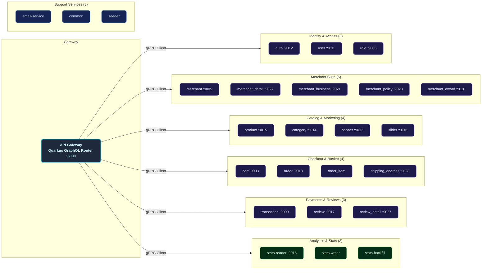

---

## Internal Service Architecture

Every logical business service is mapped as a decoupled submodule following structured clean architecture rules.

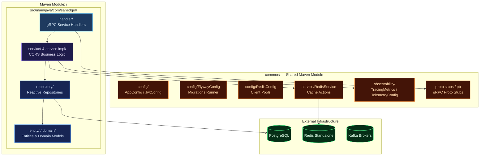

---

## Data & Event Flow

### Synchronous Flow (GraphQL Proxy & Cache Read-Through)

All external client API requests go through the GraphQL schema exposed by the Quarkus API Gateway. The API Gateway validates the JWT/API Key, resolves the requested query/mutation against the correct downstream gRPC microservice, checks the Redis cache, and fetches PostgreSQL if a cache miss occurs.

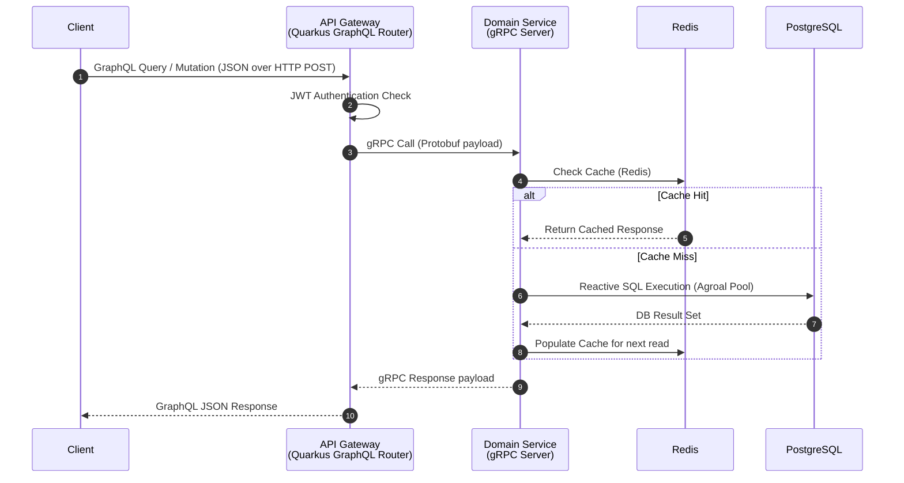

### Asynchronous Flow (Kafka Notification Event pipeline)

High-performance transaction modifications trigger background notification events published directly to Apache Kafka brokers. The isolated Email service listens to Kafka, maps the events, and sends SMTP email notifications.

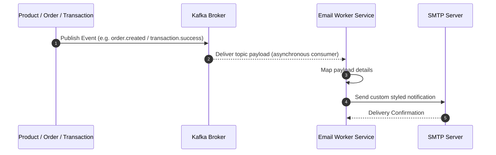

---

## Observability Architecture

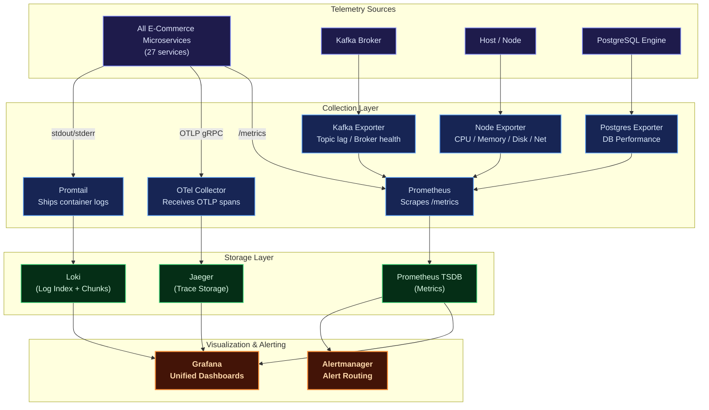

| Pillar | Tool | Purpose |
| :--- | :--- | :--- |
| **Metrics** | Prometheus + Grafana | Core metrics tracking (CPU, memory, request error rates, gRPC latencies, DB connection states). |
| **Logging** | Loki + Logback | Centralized structured JSON logger for indexing logs by service, queryable via LogQL. |
| **Tracing** | OpenTelemetry + Jaeger | Distributed system tracing across API gateway and internal gRPC services. |
| **Alerting** | Alertmanager | Automated notification system triggered during latency hikes or service disconnects. |


## Chaos Engineering Platform

The payment gateway features a built-in **reactive Chaos Engineering engine** to continuously test system resilience under failure conditions (database spikes, slow endpoints, CPU stress, and memory leaks). 

### How It Works
The chaos engine is managed by [ChaosManager.java](./common/src/main/java/com/sanedge/common/chaos/ChaosManager.java) which dynamically watches the configuration file [chaos.yaml](./chaos.yaml) for modifications:
- **Dynamic Hot-Reloading**: Every 5 seconds, the engine checks `chaos.yaml` for changes. Adjusting values or toggling policies will update the running system instantly without requiring a service restart.

### Injection Mechanisms
1. **HTTP Routing Chaos** ([ChaosHttpMiddleware.java](./common/src/main/java/com/sanedge/common/chaos/ChaosHttpMiddleware.java)): Intercepts API router entry points to inject specified latency hikes or HTTP errors (e.g., status code 429 - rate limits).
2. **Database SQL Chaos** ([ChaosSqlProxy.java](./common/src/main/java/com/sanedge/common/chaos/ChaosSqlProxy.java)): Wraps database clients in a dynamic proxy, injecting database transaction latency or simulating sudden lock wait timeouts/deadlocks when queries hit matching tables.
3. **Resource Stress Chaos** ([ChaosResourceSabotage.java](./common/src/main/java/com/sanedge/common/chaos/ChaosResourceSabotage.java)): Spawns CPU/memory pressure routines to simulate container hardware throttling or memory exhaustion.

---

## Kafka Event Architecture

The platform uses **Apache Kafka** as the asynchronous event backbone. Events are published via the **transactional outbox pattern** for reliability, and consumed by domain-specific consumers. The full audit is documented in [KAFKA_AUDIT.md](./KAFKA_AUDIT.md).

### Topic Registry Summary

| Category | Topics | Producer → Consumer | Delivery |
| :------- | :----- | :------------------ | :------- |
| **Email Notifications (8)** | `email-service-topic-auth-register`, `-auth-forgot-password`, `-auth-verify-code-success`, `-merchant-create`, `-merchant-update-status`, `-merchant-document-create`, `-merchant-document-update-status`, `-transaction-create` | Auth/Merchant/Transaction → Email Service | Fire-and-forget + DLQ |
| **Merchant Cache Invalidation** | `merchant-service-topic-transaction-event` | Transaction (outbox) → Merchant | Cache evict |
| **Transaction Cache Invalidation** | `transaction-service-topic-merchant-status-event` | Merchant → Transaction | Cache evict |

### Transactional Outbox Pattern

The Transaction Service writes events to an `outbox` table **within the same database transaction** as business data. The `OutboxPublisher` background worker then relays events to Kafka asynchronously, guaranteeing **no event loss** even during Kafka outages.

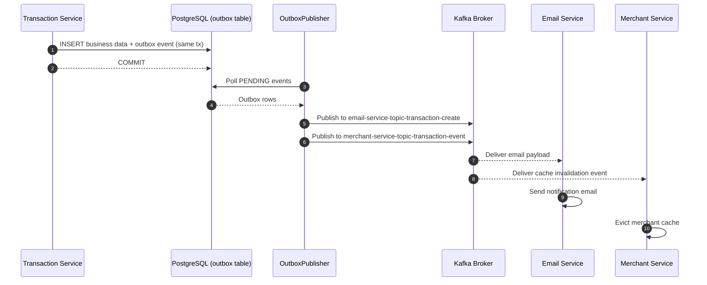

### Consumer Architecture

| Consumer | Group | Topics | Behavior |
| :------- | :---- | :----- | :------- |
| **EmailService** | `email-service-group` | 8 email topics | Manual commit, DLQ on exhausted retry, process-local dedup |
| **MerchantKafkaConsumerService** | `merchant-service-group` | `merchant-service-topic-transaction-event` | Evict merchant cache |
| **TransactionKafkaConsumerService** | `transaction-service-group` | `transaction-service-topic-merchant-status-event` | Evict transaction cache |

### Dead Letter Queue (DLQ)

Email topics support DLQ: on exhausted retries, events are published to `<topic>.dlq` with envelope `{ original_topic, original_partition, original_offset, failure, payload }`. Manual commit ensures no message loss.

---

## ClickHouse Analytics Layer

The platform uses **ClickHouse** as a columnar analytics database for high-performance statistical queries, decoupled from the transactional PostgreSQL store.

### Architecture

| Component | Role | Description |
| :-------- | :--- | :----------- |
| **stats-reader** | gRPC Analytics Server (port `:9015`, HTTP `:8096`) | Serves pre-aggregated statistical queries via gRPC. Each handler builds SQL queries against ClickHouse, caches results in Redis with configurable TTL (300s default). |
| **stats-writer** | Kafka Consumer (HTTP `:8095`) | Consumes domain events from Kafka topics (`stats.payment.*.event`), deduplicates, batches, and writes to ClickHouse tables in near-real-time. |
| **stats-backfill** | One-shot Batch Loader | Reads historical rows from OLTP PostgreSQL tables, enqueues events into outbox tables (status PENDING), which are relayed to Kafka via `OutboxPublisher` → `stats-writer` → ClickHouse. |

### Query Flow

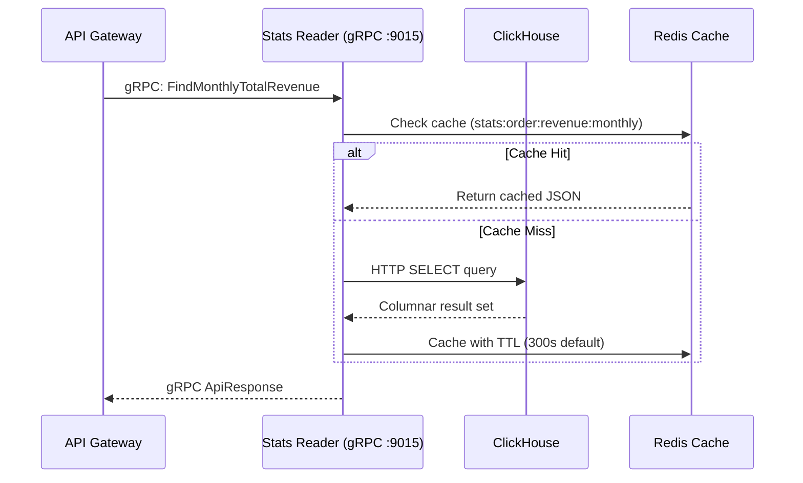

### Stats Writer Pipeline

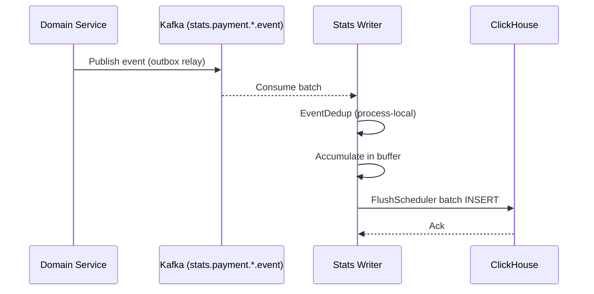

| Component | Purpose |
| :-------- | :------ |
| `StatsKafkaConsumer` | Kafka consumer subscribes to `stats.payment.*.event` topics |
| `EventDedup` | Process-local deduplication to prevent duplicate writes |
| `ClickHouseBatchWriter` | Batch INSERT into ClickHouse tables |
| `FlushScheduler` | Timer-based flush: accumulates events, flushes every N seconds |
| `ClickHouseSchemaInitializer` | Auto-creates ClickHouse tables on startup |

### Stats Backfill Job

One-shot job for bootstrapping ClickHouse with historical data from PostgreSQL. Writing through the outbox gives **idempotency for free** — re-running hits the unique `event_id` constraint (`backfill:<domain>:<id>`) and inserts nothing.

**Usage:**

```sh
BACKFILL_DOMAINS=all java -jar stats-backfill/target/quarkus-app/quarkus-run.jar
BACKFILL_DOMAINS=transaction,order BACKFILL_FROM=2024-01-01T00:00:00Z java -jar stats-backfill/target/quarkus-app/quarkus-run.jar
```

---

## Deployment Architectures

### Docker Compose (Local Development)

The Docker Compose configuration provisions PostgreSQL, Redis, Kafka, and observability containers. Java services run as **independent JVM processes** on the host, each with its own gRPC server and database connection pool — true microservice deployment.

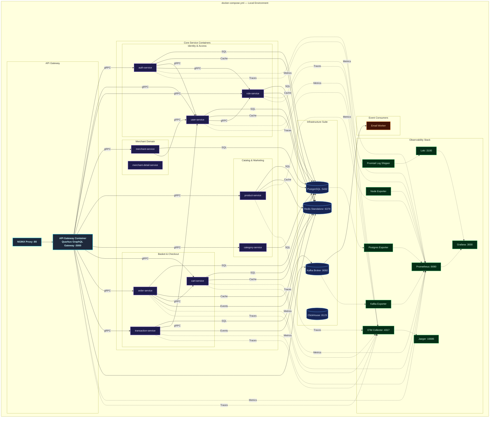

---

### Kubernetes (Production Clustering)

The production-grade Kubernetes architecture is designed for high availability, fault tolerance, and seamless horizontal scaling. All manifests are defined inside the custom `ecommerce` namespace, route edge traffic using NGINX pods acting as a LoadBalancer, and manage service scalability using individual HPAs.

```mermaid
flowchart TB
    classDef client fill:#0f172a,stroke:#38bdf8,color:#e0f2fe,stroke-width:2px,font-weight:bold
    classDef ingress fill:#0f172a,stroke:#06b6d4,color:#e0f7fa,stroke-width:2px,font-weight:bold
    classDef k8sSvc fill:#1e293b,stroke:#22d3ee,color:#cffafe,stroke-width:2px,font-weight:bold
    classDef pod fill:#1e1b4b,stroke:#a78bfa,color:#ede9fe,stroke-width:1.5px
    classDef stateful fill:#172554,stroke:#60a5fa,color:#dbeafe,stroke-width:1.5px
    classDef hpa fill:#064e3b,stroke:#34d399,color:#ecfdf5,stroke-width:1px,stroke-dasharray: 5 5
    classDef obs fill:#052e16,stroke:#4ade80,color:#dcfce7,stroke-width:1.5px

    Client["Client Applications<br/>(HTTPS Requests)"]:::client

    subgraph K8sCluster["Kubernetes Cluster — Namespace: ecommerce"]
        direction TB

        subgraph IngressLayer["Edge Reverse Proxy (NGINX)"]
            NGINX_SVC["nginx-service<br/>(LoadBalancer :80)"]:::k8sSvc
            NGINX_POD["nginx-pods"]:::pod
        end

        subgraph GatewayServices["GraphQL API Gateway (Scalable Deployment)"]
            APIGW_SVC["apigateway-service<br/>(ClusterIP :5000)"]:::k8sSvc
            APIGW_PODS["apigateway-pods"]:::pod
            APIGW_HPA["apigateway-hpa"]:::hpa
        end

        subgraph DomainServices["Internal gRPC Microservices"]
            direction TB
            
            subgraph IdentityZone["Identity Suite"]
                AUTH_POD["auth-pods"]:::pod
                USER_POD["user-pods"]:::pod
                ROLE_POD["role-pods"]:::pod
                AUTH_SVC["auth-service (gRPC)"]:::k8sSvc
                USER_SVC["user-service (gRPC)"]:::k8sSvc
                ROLE_SVC["role-service (gRPC)"]:::k8sSvc
            end

            subgraph MerchantZone["Merchant Suite"]
                MERCH_POD["merchant-pods"]:::pod
                MERCH_SVC["merchant-service (gRPC)"]:::k8sSvc
            end

            subgraph CatalogZone["Catalog & Products"]
                PROD_POD["product-pods"]:::pod
                CAT_POD["category-pods"]:::pod
                PROD_SVC["product-service (gRPC)"]:::k8sSvc
                CAT_SVC["category-service (gRPC)"]:::k8sSvc
            end

            subgraph MovementsZone["Ledgers & Checkout Flow"]
                CART_POD["cart-pods"]:::pod
                ORDER_POD["order-pods"]:::pod
                TX_POD["transaction-pods"]:::pod
                CART_SVC["cart-service (gRPC)"]:::k8sSvc
                ORDER_SVC["order-service (gRPC)"]:::k8sSvc
                TX_SVC["transaction-service (gRPC)"]:::k8sSvc
            end
            
            PodsHPA["Domain Services HPAs<br/>(auth, product, merchant, order, etc.)"]:::hpa
        end

        subgraph DataObservability["Infrastructure & Databases"]
            PG_SVC["postgres-service<br/>(ClusterIP :5432)"]:::k8sSvc
            PG_POD["postgres-pods"]:::pod

            REDIS_SVC["redis-service<br/>(ClusterIP :6379)"]:::k8sSvc
            REDIS_POD["redis-pod"]:::pod

            KAFKA_SVC["kafka-service<br/>(ClusterIP :9092)"]:::k8sSvc
            KAFKA_POD["kafka-pods"]:::pod
        end

        subgraph BackgroundWorkers["Event Consumers"]
            EMAIL_SVC["email-service<br/>(ClusterIP)"]:::k8sSvc
            EMAIL_PODS["email-pods"]:::pod
            EMAIL_HPA["email-hpa"]:::hpa
        end

        subgraph K8sObs["Observability Namespace Suite"]
            PROM_SVC["prometheus-service<br/>(ClusterIP :9090)"]:::k8sSvc
            PROM_POD["prometheus-pod"]:::pod

            OTEL_SVC["otel-collector-service<br/>(ClusterIP :4317)"]:::k8sSvc
            OTEL_POD["otel-collector-pod"]:::pod

            LOKI_SVC["loki-service<br/>(ClusterIP :3100)"]:::k8sSvc
            LOKI_POD["loki-pod"]:::pod

            JAEGER_SVC["jaeger-service<br/>(ClusterIP :16686)"]:::k8sSvc
            JAEGER_POD["jaeger-pod"]:::pod

            GRAFANA_SVC["grafana-service<br/>(ClusterIP :3000)"]:::k8sSvc
            GRAFANA_POD["grafana-pod"]:::pod

            ALERTMGR_SVC["alertmanager-service<br/>(ClusterIP :9093)"]:::k8sSvc
            ALERTMGR_POD["alertmanager-pod"]:::pod

            PROMTAIL["promtail-daemonset"]:::pod
            
            KAFKAX_SVC["kafka-exporter-service"]:::k8sSvc
            KAFKAX_POD["kafka-exporter-pod"]:::pod

            NODEX_SVC["node-exporter-service"]:::k8sSvc
            NODEX_POD["node-exporter-daemonset"]:::pod
        end
    end

    Client -->|HTTPS :443| NGINX_SVC
    NGINX_SVC --> NGINX_POD
    NGINX_POD -->|Proxy Pass| APIGW_SVC
    APIGW_SVC --> APIGW_PODS
    APIGW_HPA -.->|Autoscales| APIGW_PODS

    APIGW_PODS -->|gRPC call| AUTH_SVC
    APIGW_PODS -->|gRPC call| USER_SVC
    APIGW_PODS -->|gRPC call| ROLE_SVC
    APIGW_PODS -->|gRPC call| MERCH_SVC
    APIGW_PODS -->|gRPC call| PROD_SVC
    APIGW_PODS -->|gRPC call| CAT_SVC
    APIGW_PODS -->|gRPC call| CART_SVC
    APIGW_PODS -->|gRPC call| ORDER_SVC
    APIGW_PODS -->|gRPC call| TX_SVC
    
    AUTH_SVC --> AUTH_POD
    USER_SVC --> USER_POD
    ROLE_SVC --> ROLE_POD
    MERCH_SVC --> MERCH_POD
    PROD_SVC --> PROD_POD
    CAT_SVC --> CAT_POD
    CART_SVC --> CART_POD
    ORDER_SVC --> ORDER_POD
    TX_SVC --> TX_POD

    AUTH_POD -->|SQL| PG_SVC
    USER_POD -->|SQL| PG_SVC
    ROLE_POD -->|SQL| PG_SVC
    MERCH_POD -->|SQL| PG_SVC
    PROD_POD -->|SQL| PG_SVC
    CAT_POD -->|SQL| PG_SVC
    CART_POD -->|SQL| PG_SVC
    ORDER_POD -->|SQL| PG_SVC
    TX_POD -->|SQL| PG_SVC

    AUTH_POD -->|Cache| REDIS_SVC
    USER_POD -->|Cache| REDIS_SVC
    ROLE_POD -->|Cache| REDIS_SVC
    PROD_POD -->|Cache| REDIS_SVC
    CART_POD -->|Cache| REDIS_SVC
    ORDER_POD -->|Cache| REDIS_SVC

    REDIS_SVC --> REDIS_POD

    AUTH_POD -->|gRPC| USER_SVC
    AUTH_POD -->|gRPC| ROLE_SVC
    USER_POD -->|gRPC| ROLE_SVC
    MERCH_POD -->|gRPC| USER_SVC
    ORDER_POD -->|gRPC| CART_SVC
    TX_POD -->|gRPC| USER_SVC

    ORDER_POD -->|Events| KAFKA_SVC
    TX_POD -->|Events| KAFKA_SVC

    KAFKA_SVC --> KAFKA_POD
    KAFKA_POD -->|Message Stream| EMAIL_SVC
    EMAIL_SVC --> EMAIL_PODS
    EMAIL_HPA -.->|Autoscales| EMAIL_PODS

    PodsHPA -.->|Autoscales| AUTH_POD
    PodsHPA -.->|Autoscales| USER_POD
    PodsHPA -.->|Autoscales| ROLE_POD
    PodsHPA -.->|Autoscales| MERCH_POD
    PodsHPA -.->|Autoscales| PROD_POD
    PodsHPA -.->|Autoscales| CAT_POD
    PodsHPA -.->|Autoscales| CART_POD
    PodsHPA -.->|Autoscales| ORDER_POD
    PodsHPA -.->|Autoscales| TX_POD

    AUTH_POD -.->|"Metrics"| PROM_SVC
    USER_POD -.->|"Metrics"| PROM_SVC
    ROLE_POD -.->|"Metrics"| PROM_SVC
    MERCH_POD -.->|"Metrics"| PROM_SVC
    PROD_POD -.->|"Metrics"| PROM_SVC
    CAT_POD -.->|"Metrics"| PROM_SVC
    CART_POD -.->|"Metrics"| PROM_SVC
    ORDER_POD -.->|"Metrics"| PROM_SVC
    TX_POD -.->|"Metrics"| PROM_SVC
    APIGW_PODS -.->|"Metrics"| PROM_SVC

    AUTH_POD -.->|"Traces"| OTEL_SVC
    USER_POD -.->|"Traces"| OTEL_SVC
    ROLE_POD -.->|"Traces"| OTEL_SVC
    MERCH_POD -.->|"Traces"| OTEL_SVC
    PROD_POD -.->|"Traces"| OTEL_SVC
    CAT_POD -.->|"Traces"| OTEL_SVC
    CART_POD -.->|"Traces"| OTEL_SVC
    ORDER_POD -.->|"Traces"| OTEL_SVC
    TX_POD -.->|"Traces"| OTEL_SVC
    APIGW_PODS -.->|"Traces"| OTEL_SVC

    PROM_SVC --> PROM_POD
    OTEL_SVC --> OTEL_POD
    LOKI_SVC --> LOKI_POD
    JAEGER_SVC --> JAEGER_POD
    GRAFANA_SVC --> GRAFANA_POD
    ALERTMGR_SVC --> ALERTMGR_POD

    OTEL_POD -.-> JAEGER_SVC
    PROMTAIL -.-> LOKI_SVC
    PROM_POD -.-> GRAFANA_SVC
    LOKI_POD -.-> GRAFANA_SVC
    PROM_POD -.-> ALERTMGR_SVC

    KAFKA_SVC -.-> KAFKAX_SVC
    KAFKAX_SVC --> KAFKAX_POD
    KAFKAX_POD -.-> PROM_SVC
    NODEX_SVC --> NODEX_POD
    NODEX_POD -.-> PROM_SVC
```

### ArgoCD App-of-Apps GitOps Architecture

The platform follows GitOps best practices using ArgoCD for declarative continuous deployments. Replicating the App-of-Apps design pattern, a root Application (`ecommerce-root`) automatically manages and tracks the states of individual child Applications mapping to Kustomize bases.

Sync waves (`argocd.argoproj.io/sync-wave` annotations) are strictly defined to guarantee database migrations run and complete before domain applications start.

```mermaid
graph TD
    classDef root fill:#1e293b,stroke:#22d3ee,color:#cffafe,stroke-width:2.5px,font-weight:bold
    classDef proj fill:#0f172a,stroke:#38bdf8,color:#e0f2fe,stroke-width:2px
    classDef app fill:#1e1b4b,stroke:#a78bfa,color:#ede9fe,stroke-width:1.5px
    classDef wave fill:#1c1917,stroke:#f59e0b,color:#fef3c7,stroke-width:1.5px
    classDef base fill:#052e16,stroke:#34d399,color:#dcfce7,stroke-width:1.5px

    RootApp["ecommerce-root<br/>(ArgoCD Root Application)"]:::root
    AppProj["ecommerce<br/>(ArgoCD AppProject)"]:::proj

    RootApp -->|Creates & Tracks| AppProj
    RootApp -->|Deploys Application Manifests| AppIndex["Child Applications List<br/>(deployments/gitops/argocd/apps/)"]:::app

    subgraph SyncWaves["Ordered Deployment Sequencing (Sync Waves 1 - 6)"]
        direction TB

        subgraph Wave1["Wave 1: Namespace & Infrastructure"]
            W1_CM["common"]:::wave
            W1_PG["infra-postgres"]:::wave
            W1_RD["infra-redis"]:::wave
            W1_KF["infra-kafka"]:::wave
        end

        subgraph Wave2["Wave 2: Database Migration"]
            W2_MIG["db-migration"]:::wave
        end

        subgraph Wave3["Wave 3: Core Domain Services"]
            W3_AUTH["service-auth"]:::wave
            W3_USR["service-user"]:::wave
            W3_ROL["service-role"]:::wave
            W3_PROD["service-product"]:::wave
            W3_CAT["service-category"]:::wave
            W3_MER["service-merchant"]:::wave
            W3_ORD["service-order"]:::wave
            W3_CRT["service-cart"]:::wave
            W3_EML["service-email"]:::wave
            W3_OTH["other-domain-services"]:::wave
        end

        subgraph Wave4["Wave 4: Financial Movements"]
            W4_TXN["service-transaction"]:::wave
        end

        subgraph Wave5["Wave 5: Reverse Proxy Gateway"]
            W5_APIGW["apigateway"]:::wave
            W5_NGINX["nginx"]:::wave
        end

        subgraph Wave6["Wave 6: Observability Suite"]
            W6_OBS["service-observability"]:::wave
        end

        Wave1 -->|Triggers next wave| Wave2
        Wave2 -->|Triggers next wave| Wave3
        Wave3 -->|Triggers next wave| Wave4
        Wave4 -->|Triggers next wave| Wave5
        Wave5 -->|Triggers next wave| Wave6
    end

    AppIndex -->|Deploys| Wave1
    AppIndex -->|Deploys| Wave2
    AppIndex -->|Deploys| Wave3
    AppIndex -->|Deploys| Wave4
    AppIndex -->|Deploys| Wave5
    AppIndex -->|Deploys| Wave6

    subgraph K8sBases["Target: Kustomize Base Resources"]
        B_COMMON["deployments/kubernetes/base/common"]:::base
        B_PG["deployments/kubernetes/base/postgres"]:::base
        B_RD["deployments/kubernetes/base/redis"]:::base
        B_KF["deployments/kubernetes/base/kafka"]:::base
        B_MIG["deployments/kubernetes/base/db-migration"]:::base
        B_AUTH["deployments/kubernetes/base/auth"]:::base
        B_USR["deployments/kubernetes/base/user"]:::base
        B_ROL["deployments/kubernetes/base/role"]:::base
        B_PROD["deployments/kubernetes/base/product"]:::base
        B_CAT["deployments/kubernetes/base/category"]:::base
        B_MER["deployments/kubernetes/base/merchant"]:::base
        B_ORD["deployments/kubernetes/base/order"]:::base
        B_CRT["deployments/kubernetes/base/cart"]:::base
        B_EML["deployments/kubernetes/base/email"]:::base
        B_TXN["deployments/kubernetes/base/transaction"]:::base
        B_APIGW["deployments/kubernetes/base/apigateway"]:::base
        B_NGINX["deployments/kubernetes/base/nginx"]:::base
        B_OBS["deployments/kubernetes/base/observability"]:::base
    end

    W1_CM -->|Reconciles| B_COMMON
    W1_PG -->|Reconciles| B_PG
    W1_RD -->|Reconciles| B_RD
    W1_KF -->|Reconciles| B_KF
    W2_MIG -->|Reconciles| B_MIG
    W3_AUTH -->|Reconciles| B_AUTH
    W3_USR -->|Reconciles| B_USR
    W3_ROL -->|Reconciles| B_ROL
    W3_PROD -->|Reconciles| B_PROD
    W3_CAT -->|Reconciles| B_CAT
    W3_MER -->|Reconciles| B_MER
    W3_ORD -->|Reconciles| B_ORD
    W3_CRT -->|Reconciles| B_CRT
    W3_EML -->|Reconciles| B_EML
    W4_TXN -->|Reconciles| B_TXN
    W5_APIGW -->|Reconciles| B_APIGW
    W5_NGINX -->|Reconciles| B_NGINX
    W6_OBS -->|Reconciles| B_OBS
```

---

## Technology Stack

| Category | Selected Technologies | Purpose |
| :--- | :--- | :--- |
| **Language** | Java 21 (Quarkus v3.31.3) | Reactive, non-blocking asynchronous Java execution. |
| **API Edge Gateway** | Quarkus SmallRye GraphQL | Reactive GraphQL API Gateway router and reverse proxy destination. |
| **RPC Inter-service** | Quarkus gRPC Client & Server | Blazing fast, contract-first synchronous gRPC communication. |
| **Database** | PostgreSQL v17 | Safe ACID ledger persistent storage system. |
| **DB Migrations** | Flyway | Incremental database schema version manager run on startup. |
| **Caching Tier** | Redis (Standalone) | In-memory key-value cache layer per service. |
| **Analytics DB** | ClickHouse | Columnar OLAP database for high-performance statistical queries. |
| **Messaging Stream** | Apache Kafka | Asynchronous high-throughput messaging event bus with transactional outbox (KRaft mode). |
| **Token Manager** | JWT | Secure stateless request authentication standard. |
| **Observability** | OpenTelemetry + Jaeger | Distributed telemetry tracing pipeline and visualization. |
| **Docker Engine** | Compose | Local environment virtualization orchestration. |
| **Orchestrator** | Kubernetes | Production-scale auto-scaling pod clustering infrastructure. |

---

## Getting Started

### Prerequisites

Ensure the following system packages are locally configured:

- [Git](https://git-scm.com/)
- [Java Development Kit (JDK 21+)](https://adoptium.net/)
- [Apache Maven](https://maven.apache.org/) (v3.9+)
- [Docker](https://www.docker.com/) & [Docker Compose](https://docs.docker.com/compose/)
- [Protobuf Compiler](https://grpc.io/docs/protoc-installation/) (optional)

### 1. Clone the Workspace

```sh
git clone https://github.com/MamangRust/modular-monolith-quarkus-ecommerce.git
cd modular-monolith-quarkus-ecommerce
```

### 2. Prepare Environment Configurations

Setup the system configurations from placeholders:

```sh
# Copy root variables
cp .env.example .env

# Copy local docker settings overrides
cp deployments/local/docker.env.example deployments/local/docker.env
```

### 3. Build the Maven Project

Compile all submodules and build the executable JAR files:

```sh
mvn clean install
```

### 4. Build Docker Images and Start Environment

Use the included build script to compile the service Docker images, then boot the Docker Compose stack:

```sh
# Start only local infrastructure and observability (no Java containers)
docker compose --env-file deployments/local/docker.env -f deployments/local/docker-compose.yml up -d
```

For host-local Java processes, load the environment and use the packaged Quarkus artifacts:

```sh
set -a
source deployments/local/docker.env
set +a
mvn install -DskipTests
```

Each microservice starts as an independent JVM process with its own gRPC server:

```sh
java -Dquarkus.http.port=8081 -jar user/target/quarkus-app/quarkus-run.jar &
java -Dquarkus.http.port=8082 -jar auth/target/quarkus-app/quarkus-run.jar &
# ... etc for each service
```

To verify the infrastructure stack:

```sh
docker compose --env-file deployments/local/docker.env -f deployments/local/docker-compose.yml ps
```

---

## Port Map Registry

| Application/Service | gRPC Port | HTTP Port | Description |
| :--- | :--- | :--- | :--- |
| **API Gateway** | — | `5000` | GraphQL API entry point, proxies to gRPC |
| **Auth Service** | `9012` | `8092` | JWT authentication & registration |
| **User Service** | `9011` | `8091` | User profile management |
| **Role Service** | `9006` | `8086` | RBAC & permission management |
| **Merchant Service** | `9005` | `8085` | Merchant onboarding & profiling |
| **Merchant Detail** | `9022` | `8087` | Merchant profile details |
| **Merchant Business** | `9021` | `8101` | Merchant business data |
| **Merchant Policy** | `9023` | `8088` | Merchant policy management |
| **Merchant Award** | `9020` | `8102` | Merchant performance awards |
| **Product Service** | `9015` | `8095` | Product catalog CRUD |
| **Category Service** | `9014` | `8094` | Product categorization |
| **Banner Service** | `9013` | `8093` | Promo banners |
| **Slider Service** | `9016` | `8104` | Home carousel slides |
| **Cart Service** | `9003` | `8083` | Shopping cart operations |
| **Order Service** | `9018` | `8098` | Checkout & order flows |
| **Shipping Address** | `9028` | `8100` | Customer addresses |
| **Transaction Service** | `9009` | `8089` | Financial audit register |
| **Review Service** | `9017` | `8097` | Ratings & feedback |
| **Review Detail** | `9027` | `8099` | Detailed review context |
| **Stats Reader** | `9015` | `8096` | ClickHouse analytics queries |
| **Stats Writer** | — | `8095` | ClickHouse event consumer |
| **Email Service** | — | `8094` | Kafka SMTP notifications |
| **Infrastructure** | | | |
| **NGINX Reverse Proxy** | — | `80` | Edge reverse proxy |
| **Grafana Dashboard** | — | `3000` | Dashboards (`admin`/`admin`) |
| **Prometheus** | — | `9090` | Metrics engine |
| **Jaeger** | — | `16686` | Distributed tracing UI |
| **PostgreSQL** | — | `5432` | Database engine |
| **ClickHouse** | — | `8123` | Analytics OLAP database |

To stop the development system and clean up resources:

```sh
docker-compose -f deployments/local/docker-compose.yml down -v
```

---

## Maven & Shell Commands Reference

| Command | Scope |
| :--- | :--- |
| `mvn clean install` | Cleans target directories, runs tests, compiles all submodules, and generates package JARs. |
| `mvn compile` | Compiles raw Java source files for all modules. |
| `./build-docker-images.sh` | Orchestrates the build of Docker images for all Quarkus microservices. |
| `docker compose --env-file deployments/local/docker.env -f deployments/local/docker-compose.yml up -d` | Launches infrastructure and observability containers only; Java services run locally on the host. |
| `docker compose --env-file deployments/local/docker.env -f deployments/local/docker-compose.yml down` | Stops infrastructure/observability containers without deleting volumes. |
| `docker compose --env-file deployments/local/docker.env -f deployments/local/docker-compose.yml logs -f <service>` | Follows logs for an infrastructure/observability container. |

---

## Workspace Directory Tree

```
quarkus-ecommerce/
├── pom.xml                         # Root Maven Parent POM
├── common/src/main/proto/          # Protobuf contracts (22 domains)
│   ├── auth.proto                  #   Identity tokens contracts
│   ├── banner/                     #   Promo Banners
│   ├── cart/                       #   Shopping Cart specifications
│   ├── category/                   #   Product Classification specifications
│   ├── common/                     #   Shared protobuf data types
│   ├── merchant/                   #   Merchant account declarations
│   ├── merchant_award/             #   Merchant Awards specifications
│   ├── merchant_business/          #   Merchant Business declarations
│   ├── merchant_detail/            #   Merchant Profiles specifications
│   ├── merchant_document/          #   Verification files specifications
│   ├── merchant_policy/            #   Merchant Policy specifications
│   ├── merchant_social_link/       #   Merchant Social Link specifications
│   ├── order/                      #   Checkout Orders specifications
│   ├── order_item/                 #   Checkout Order Items details
│   ├── product/                    #   Product Catalog specifications
│   ├── review/                     #   Ratings specifications
│   ├── review_detail/              #   Ratings context specifications
│   ├── role/                       #   Role mapping specifications
│   ├── shipping_address/           #   Customer Address specifications
│   ├── slider/                     #   Front Sliders specifications
│   ├── transaction/                #   General audit register specifications
│   └── user/                       #   User CRUD data properties
├── common/                         # Shared Maven library Module
│   └── src/main/java/com/sanedge/common/
│       ├── config/                 #   AppConfig, JwtConfig, RedisConfig, FlywayConfig
│       ├── observability/          #   TracingMetrics config
│       ├── service/                #   RedisService utilities
│       └── pb/                     #   Compiled Java Protobuf gRPC stubs
├── gateway/                        # GraphQL API Gateway (GraphQL → gRPC proxy, port :5000)
├── auth/                           # Authentication engine service
├── user/                           # User profiles service (CQRS)
├── role/                           # RBAC authorization service
├── merchant/                       # Merchant onboarding & reports service
├── merchant_detail/                # Merchant profile details service
├── merchant_business/              # Merchant business data registry service
├── merchant_policy/                # Merchant policy management service
├── merchant_award/                 # Merchant performance awards service
├── product/                        # Product catalog management service
├── category/                       # Product catalog categorization service
├── banner/                         # Front promo banners service
├── slider/                         # Home carousels sliders service
├── cart/                           # Shopping cart service
├── order/                          # Order and checkout processor service
├── shipping_address/               # Shipping addresses service
├── transaction/                    # Financial ledger & payments service
├── review/                         # Ratings and review submissions service
├── review_detail/                  # Detailed review context service
├── email-service/                  # Asynchronous Kafka notifications service
├── stats-reader/                   # Stats Reader — ClickHouse gRPC queries (gRPC :9015 | HTTP :8096)
├── stats-writer/                   # Stats Writer — Kafka→ClickHouse batch consumer (HTTP :8095)
├── stats-backfill/                 # Stats Backfill — one-shot PostgreSQL→outbox→Kafka→ClickHouse loader
├── seeder/                         # Seeder — DB seed data loader
├── deployments/
│   ├── local/                      #   Docker compose infrastructure files
│   └── kubernetes/                 #   Production K8s deployment manifests
├── observability/                  #   Telemetry pipelines configurations (Loki, OTEL, Alertmanager)
├── grafana/                        #   Pre-configured dashboard JSON files
├── nginx/                          #   Reverse-proxy NGINX rules
└── images/                         #   Architecture diagrams & dashboard screenshots
```

---

## License

This project is open-sourced under the MIT License for educational and development purposes.

---

<p align="center">
  Built with Java, Quarkus, gRPC, Apache Kafka, ClickHouse, and a passion for high-performance reactive microservices.
</p>